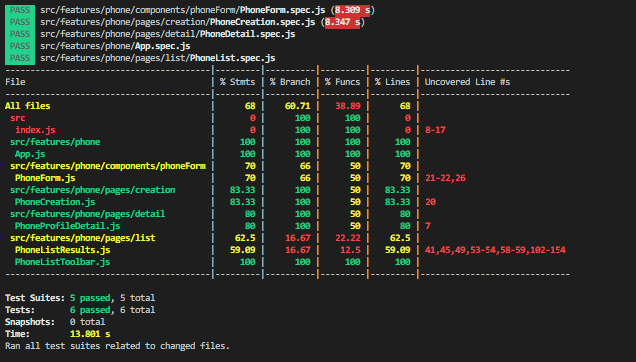

# Phone Catalogue Code Challenge

## Requirements

[REACT-PhoneCatalog-code-challenge](./docs/REACT-PhoneCatalog-code-challenge.pdf)

### Compoments
- **Gateway**: ***Nginx*** proxy to forwarding request form client
- **Server**:  ***Nestjs*** server and **PostgreSQL**  database to process request and store data
- ***Client***: **Reactjs** and **Redux** client to render UI and call API. 

## Features

- :heavy_check_mark: Rest API CRUD phone
- :heavy_check_mark: Server Swagger docs 
- :heavy_check_mark: Server Unit testing 
- :heavy_check_mark: Server end to end testing 
- :heavy_check_mark: Material UI React
- :heavy_check_mark: Redux state management
- :heavy_check_mark: React unit testing
- :heavy_check_mark: Proxy docker nginx
- :heavy_check_mark: Server docker build and run
- :heavy_check_mark: Client multiple stages docker build and run

## Installation

### Server 

```bash
cd server
```

```bash
npm install
```

```
npm install -g @nestjs/cli
```

```bash
npm run start:dev
```

swagger docs: [http://localhost:3001/api/v1/swagger](http://localhost:3001/api/v1/swagger)

### Client


```bash
cd client
```

```bash
npm install
```

```bash
npm start
```

swagger docs: [http://localhost:3000](http://localhost:3000)

## Deployment

## All in one

```bash
docker compose build
docker compose up -d
```

## Testing

### Server
unit test
```bash
npm run test:cov
```

end to end test
```bash
npm run test:e2e
```


### Client
unit test
```bash
npm run test:cov
```



